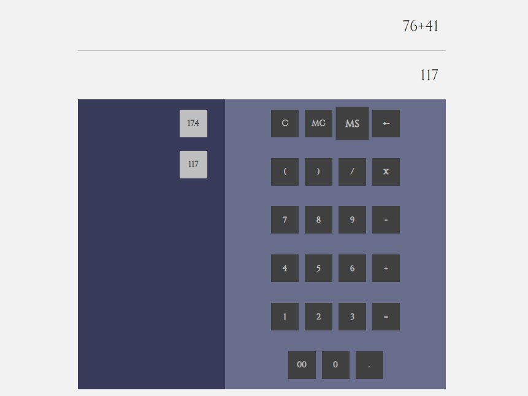

# [Multi-Memory Calculator](https://fazeelanizam13.github.io/multi-memory-calculator/)

A calculator which lets you perform calculations (addition, subtraction, multiplication and division) with the ability to store multiple number of results for later use. The memory store is visible to the user, and makes it for an easier retrieval of stored numbers, for ongoing calculations.

## Getting Started

No prerequisites or installing required. It's just needed to download the zip, unzip it and open the index.html file on your browser.

Here's a rundown on how this calculator works and what the buttons and different parts of the layout stand for:

* The top portion (above the horizontal line) of display is for the mathematical expression entered.  
The bottom portion displays the evaluation of the expression (as long as it's a valid one.)

* **Digits** (including **double-zero**), four operators (**+**, **-**, **/**, **x**), **decimal point**, **opening and closing brackets** and the **equal sign** serve their intended purpose.

* **C** - Clears the display. 

* **←** - Clears the last entry. Works like the 'Backspace' on the QWERTY keypad.

* **MS** (Memory Store) - Saves the current evaluation and it will be displayed on the left-hand-side panel. Future saves goes below the previous save.  Clicking on a particular save appends it to the current expression on the display.

* **MC** (Memory Clear) - Clears the last entry in the memory store. Clicking on it repeatedly empties the store of stored results one by one.  
*Obviously, this differs from regular calculators where only one result can be stored. On these caculators, pressing **MC** clears the said result (meaning the whole memory store).*

## Built With

* [AngularJS](https://angularjs.org/)

## Authors

* **Fazeela Nizam** @[fazeelanizam13](https://github.com/fazeelanizam13)
